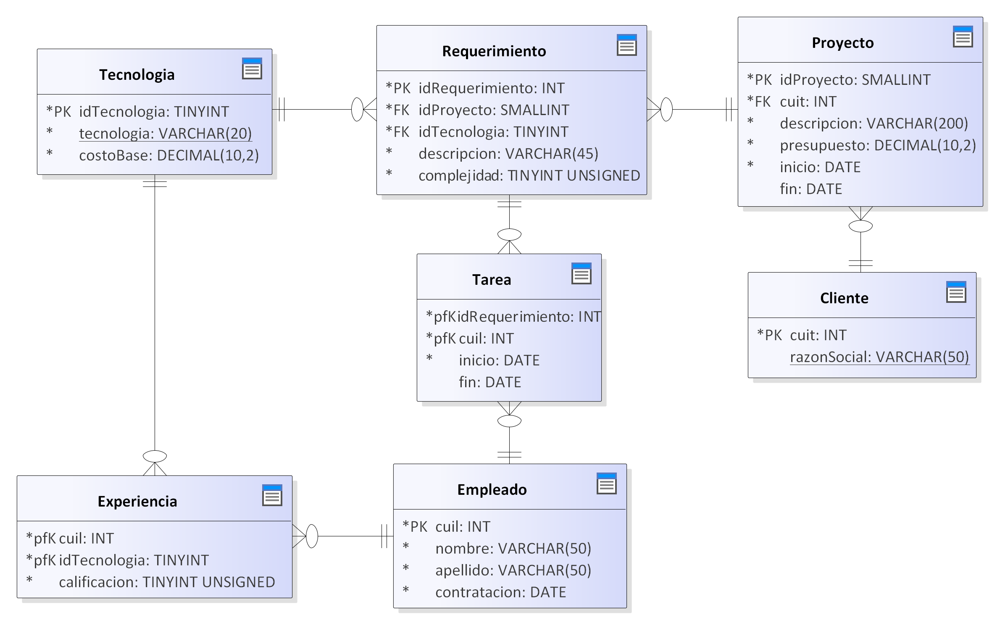

<h1 align="center">E.T. Nº12 D.E. 1º "Libertador Gral. José de San Martín"</h1>
<p align="center">
  
</p>

# Software Factory

Material de consumo para las consultas de Base de Datos y Administración y Gestión de Bases de Datos.

## DER



## Comenzando 🚀

Clonar el repositorio github, desde Github Desktop o ejecutar en la terminal o CMD:

```
git clone https://github.com/ET12DE1Computacion/BD-SoftwareFactory
```

## Pre-requisitos 📋

- MySQL 8 🐬

## Despliegue 📦

1. Abrir la terminal en el directorio donde estan los scripts (recomendamos tener MySQL agregado en tus **Variables de entorno**).
1. Ejecutar el comando: `mysql -u usuario -p` donde *usuario* es el nombre de usuario con el que entras al sistema. Si estas en la secu podes usar: `mysql -u root -p`. Se te va a preguntar por la contraseña de tu usuario, recorda que si estas en la secu la misma es *root*
1. Ya dentro del cliente de `MySQL` tipeamos `source install.sql` y nos deberia quedar algo como: `mysql> source install.sql`

## Ejercicios

- [Base de Datos](ejercicios/04%20BD/README.md)
- [Administración y Gestión de Base de Datos](<ejercicios/05 AGBD/README.md>)
